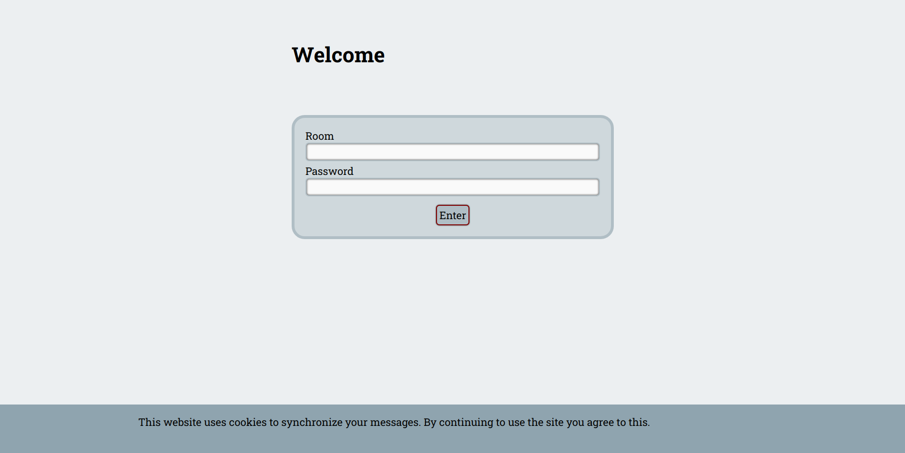
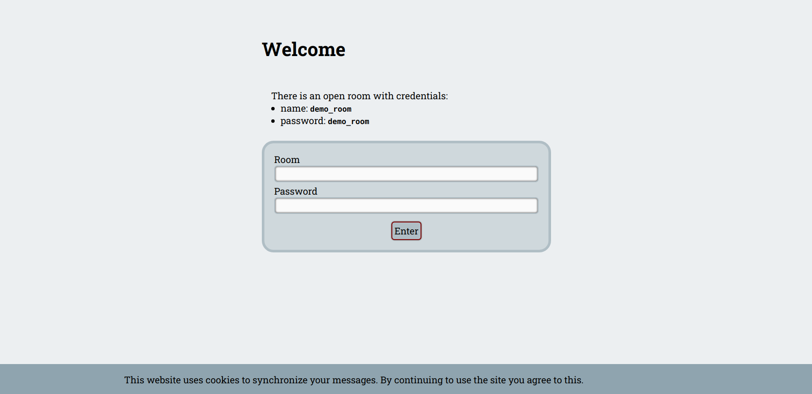

# Deployment guide for Heroku

This is a step-by-step guide for deploying the web app to Heroku, similar to the
[demo page](https://calm-springs-86222.herokuapp.com/).

If you notice any mistakes, feel free to open an issue.

## Clone and make a separate branch

First, clone the repo to a directory of your liking, and `cd` into it.

I recommend creating a new branch for deployment, since we'll add a few files
which we don't want to track normally.

For example:

```bash
# Clone the repo.
git clone https://github.com/pandrei7/personal_forum.git YOUR_DIR
cd YOUR_DIR

# Make a new branch.
git checkout -b deploy
```

## Heroku initialization

### Create an app

Now we can create an app in this directory. We'll use
[this rust buildpack](https://github.com/emk/heroku-buildpack-rust).

```bash
heroku create --buildpack emk/rust
```

### Add a dabatase

The web app requires a PostgreSQL database to run.
Add one with the following command:

```bash
heroku addons:create heroku-postgresql:hobby-dev
```

## Add some configuration files

- The Rocket framework needs a nightly version of the Rust compiler to work.
We can tell Rust to use the nightly version by creating a `rust-toolchain` file
with the following contents:

    ```lang-none
    nightly
    ```

- Create a `Procfile` file, telling Heroku how it should run our app.
Paste this code inside it:

    ```lang-none
    web: ROCKET_PORT=$PORT ROCKET_ENV=prod ROCKET_DATABASES={db={url="$DATABASE_URL"}} ./target/release/personal_forum
    ```

    This command tells Rocket to use the port and database path assigned to us by
    Heroku.

- Commit these files.

    ```bash
    git add rust-toolchain Procfile
    git commit -m "Add some configuration files for deployment"
    ```

### Make deployment faster (Optional)

Building the app on the server will probably take a long time, especially the
first time. If your computer can build binaries compatible with the Heroku
server, you can compile the program on your own and simply push it to the
server, thereby skipping the build step.

To do this, add a `RustConfig` file with the following contents:

```lang-none
RUST_SKIP_BUILD=1
```

Then, compile the binary with the `--release` flag.

```bash
cargo build --release
```

Commit these files. The binary has to be added forcefully, since git normally
ignores it.

```bash
git add -f RustConfig target/release/personal_forum
git commit -m "Skip the building step"
```

> **Remember**: If you choose to do this, you will need to recompile and commit
the binary each time you make changes.

## Push to Heroku

Now we can push our deployment branch to Heroku's master branch.

```bash
git push heroku deploy:master
```

Once pushed, the app will be compiled and run. This will probably take a while.

When finished, the output might look like this. You can access the site at the
URL mentioned there.


The website should look like this:



## Add an admin

The server is controlled by logging into the admin pane using admin credentials.
For security reasons, these credentials are held in the database and can only
be modified manually. We will connect to the database using
[psql](http://postgresguide.com/setup/install.html).
You can learn a bit about it
[here](http://postgresguide.com/utilities/psql.html).

We'll obtain the database's URI from [data.heroku.com](https://data.heroku.com/).
Click on this app's database and access the `Settings` section.
Copy the URI field from `Database Credentials`.


Choose a username and a password. Obtain the SHA-256 hash of your chosen password,
then insert these in the `admins` table.

```bash
# Obtain your password hash.
echo -n 'YOUR_PASSWORD' | sha256sum

# Log into the database.
psql YOUR_POSTGRES_URI
```

```sql
insert into admins (username, password) values ('YOUR_USERNAME', 'YOUR_HASH');
```

Quit by typing `\q`.

You should now be able to login by accessing the `/admin_login` path.

## Next steps

The deployment is now complete. You probably want to create some rooms and add
a welcome message, which can be done from the admin pane. If you want to create
a demo page for this app, you should display the credentials for open rooms in
the welcome message. Don't forget that you can type HTML code for the message.


